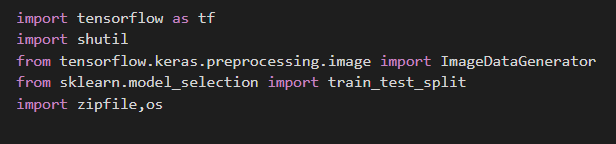
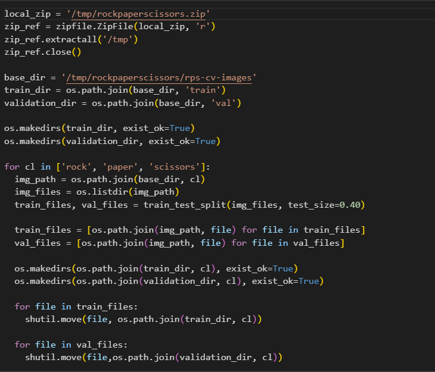
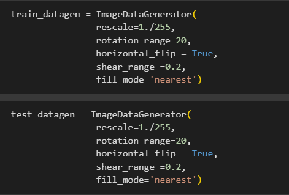
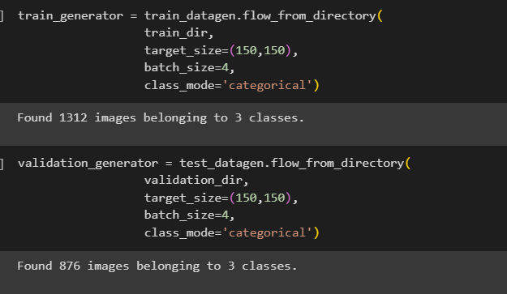
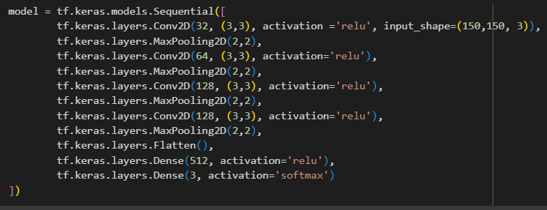
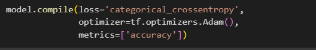
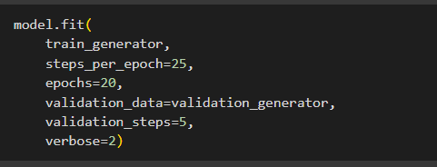
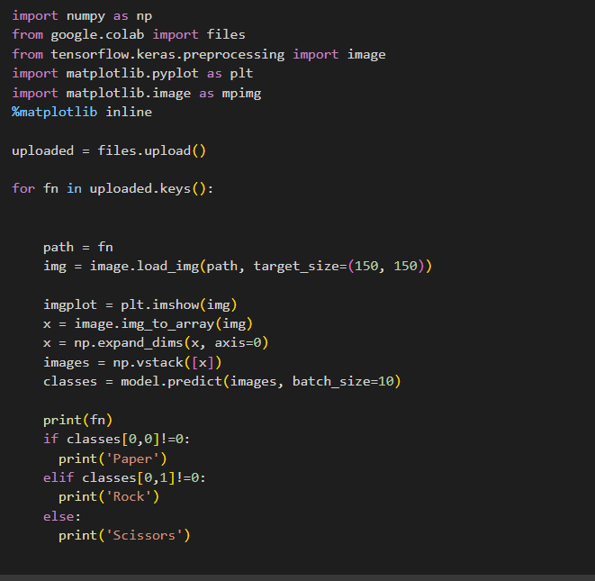
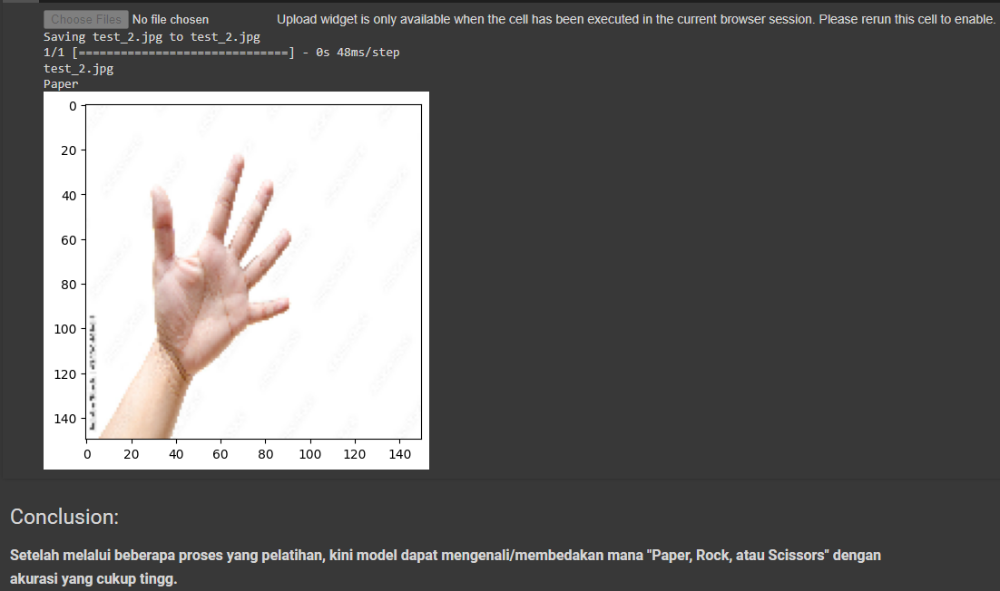

# Proyek-Klasifikasi-Gambar

Pada repository kali ini saya akan menjelaskan bagaimana membuat machine learning, menggunakan `TensorFlow`. TensorFlow sendiri merupakan software opensource yang digunakan untuk komputasi numerik dan proyek pembelajaran Machine Learning. TensorFlow dirancang oleh tim Google Brain, kegunaannya untuk memudahakan penggunaan Machine Learning.

TensorFlow memungkinkan developer untuk membuat `Dataflow Graph`, yang artinya struktur yang mendeskripsikan bagaimana data bergerak melalui serangkai node pemrosesan.

Yang mana codenya dapat ditemukan [disini](./paper_rock_scissors.ipynb)
- Import library yang dibutuhkan
    

- Mempersiapkan dataset yang akan digunakan, dan dapat diunduh dengan perintah berikut, dataset dapat diunduh melalui [link ini](https://github.com/dicodingacademy/assets/releases/download/release/rockpaperscissors.zip)
    

- Ekstrak dataset yang masih berbentuk zip, kemudian arahkan kemana ingin menyimpan/mengkestrak data tersebut.
Kemudian buat directory train dan val(validation) untuk menempatkan dataset yang nantinya akan digunakan untuk pelatihan model. Yang mana pada code di bawah ini, didefinisikan bahwa ukuran validation set 40% dari total dataset.
    
- Pada langkah ini, akan menerapkan ImageDataGenerator untuk data latih dan data validasi. ImageDataGenerator merupakan sebuah fungsi yang sangat berguna untuk mempersiapkan data latih dan data validasi. Beberapa kemudahan yang disediakan ImageDataGenerator antara lain preprocessing data, pelabelan sampel otomatis, dan augmentasi gambar. Augmentasi gambar merupakan sebuah teknik yang dapat digunakan untuk memperbanyak data latih dengan cara menduplikasi gambar yang telah ada dengan menambahkan variasi tertentu. Kode berikut menunjukkan proses augmentasi gambar pada setiap sampel di dataset
    

- Selanjutnya, siapkan data latih dan validasi dari kumpulan data gambar yang di-load dalam     memori melalui fungsi flow() berikut.
    

- Setelah data siap, maka langkah selanjutnya membangun model Convolutional Neural Network (CNN). Pembuatan model CNN pada keras mirip dengan pembuatan model Multi Layer Perceptron (MLP).
    

- Memanggil fungsi compile pada objek model, dan tentukan loss function serta optimizer
    

- Kemudian melatih model yang telah ditentukan. Dengan menjalankan kode di bawah ini
    

- Setelah model berhasil dilatih, langkah selanjutnya menguji model dengan kode dibawah ini:
    

- Dengan mengunggah foto seperti foto di bawah ini, model dapat mengenalinya sebagai "Paper" yang mana sudah sesuai dengan model pelatihan yang telah ditentukan
    