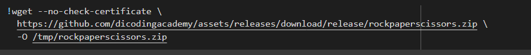

# Proyek-Klasifikasi-Gambar

In this repository, I will explain how to create machine learning using TensorFlow. TensorFlow itself is an open-source software used for numerical computation and Machine Learning projects. TensorFlow was designed by the Google Brain team, its use is to facilitate the use of Machine Learning.

TensorFlow allows developers to create a `Dataflow Graph`, which means a structure that describes how data moves through a series of processing nodes.

The code can be found [here](./paper_rock_scissors.ipynb)
- Import the required library
    

- Prepare the dataset to be used, and can be downloaded with the following command, the dataset can be downloaded via this [link](https://github.com/dicodingacademy/assets/releases/download/release/rockpaperscissors.zip)
    

- Extract the dataset that is still in zip form, then direct where you want to save/extract the data. Then create a train and val(validation) directory to place the dataset that will be used for model training. In which the code below defines that the size of the validation set is 40% of the total dataset.
    
- At this step, apply ImageDataGenerator to the training data and validation data. ImageDataGenerator is a very useful function for preparing training data and validation data. Some of the conveniences provided by ImageDataGenerator include preprocessing data, automatic sample labeling, and image augmentation. Image augmentation is a technique that can be used to multiply training data by duplicating existing images by adding certain variations. The following code shows the process of augmenting images on each sample in the dataset.
    

- Next, prepare the training data and validation from the collection of images that are loaded into memory through the following flow() function.
    

- Once the data is ready, the next step is to build a Convolutional Neural Network (CNN) model. Creating a CNN model in keras is similar to creating a Multi Layer Perceptron (MLP) model.
    

- Call the compile function on the model object, and determine the loss function and optimizer
    

- Then train the specified model. By running the code below
    

- After the model is successfully trained, the next step is to test the model with the code below
    

- By uploading a photo like the one below, the model can recognize it as “Paper” which is already in accordance with the training model that has been determined
    